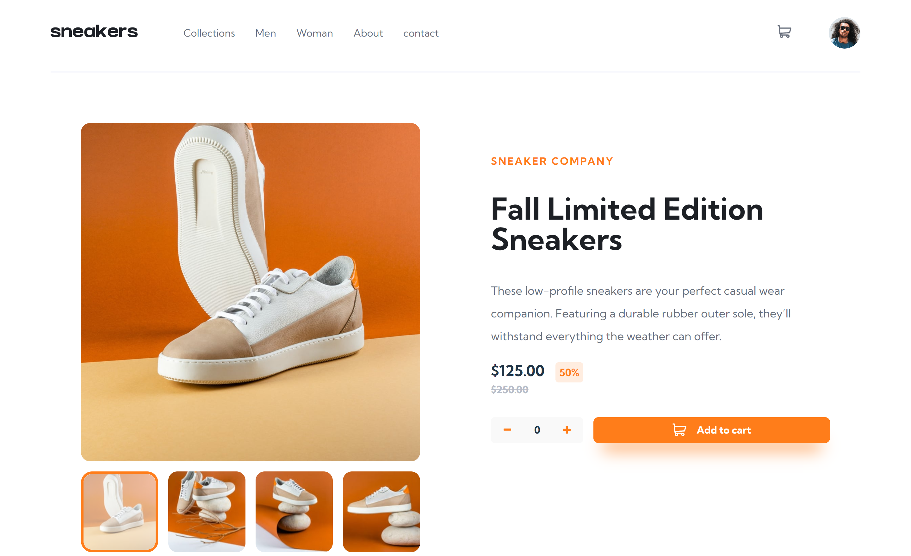

# ecommerce-product-page-main

This is a solution to the [E-commerce product page challenge on Frontend Mentor](https://www.frontendmentor.io/challenges/ecommerce-product-page-UPsZ9MJp6). 

## Overview

### The challenge

Users should be able to:

- View the optimal layout for the site depending on their device's screen size
- See hover states for all interactive elements on the page
- Open a lightbox gallery by clicking on the large product image
- Switch the large product image by clicking on the small thumbnail images
- Add items to the cart
- View the cart and remove items from it

### Screenshot

### Links

- Live Site URL: [Add live site URL here](https://yonathan-palma.github.io/ecommerce-product-page-main/)

## My process

### Built with

- Semantic HTML5 markup
- CSS custom properties
- Flexbox
- CSS Grid
- [React](https://reactjs.org/) - JS library

### Useful resources

- [props drilling v/s context](https://blog.logrocket.com/solving-prop-drilling-react-apps/)

## Author

- Website - [Yonathan Palma](https://github.com/yonathan-palma)
- Frontend Mentor - [@yonathan-palma](https://www.frontendmentor.io/profile/yonathan-palma)

